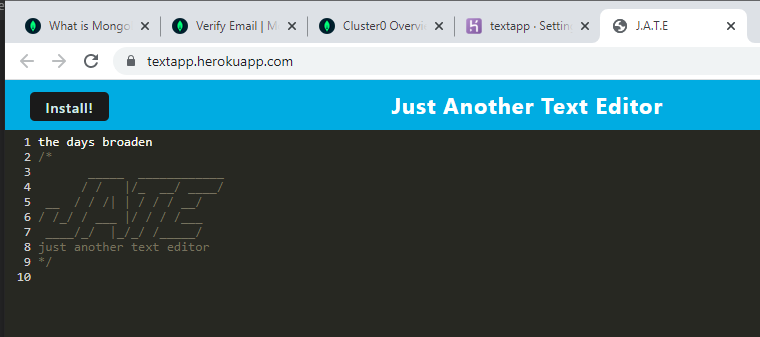

# Text Editor

 []
 
 ## Description:
 Single page text editor application that meets PWA criteria (Progressive Web Application)

## Contents
  
  
  2. [Installation](#installation)
  
  3. [Usage](#usage)
  
  4. [Contributing](#contributing)
  
  5. [Tests](#tests)
  
  
## Installation:
  
  clone the repository.
  Because this is a PWA (Progressive Web Application), you can also install it from the deployed application by clicking the 'install' button in the upper left of your screen. See "Usage" section below for how to start the app from the VScode command line.
  
  ---
  
## Usage:
 
 To utilize the text editor: Go to VScode. Run"npm start" in the client directory. Open a tab in your browser to http://localhost:3000/

  ---
 
  ## License
  
  License used for this project - MIT
  [![License: MIT]](https://opensource.org/licenses/MIT)
  
  ---
  
  ## Contributing:
  
  Please follow these instructions to contribute to the project:
  create pull request from seperate branch and await approval
  
  ---
  
  ## Tests:
  
  no test required. simply run the app

  
  ---
  
  ## Questions
  
  * GitHub Username: WSCoding
  * Link to Github user profile: github.com/whitspa
  * Email Address: whitspa64@duck.com

## Link to github repository
https://github.com/whitspa/texteditor

## Link to the deployed application
https://textapp.herokuapp.com/
  
 
  A screen shot of the application is below:

